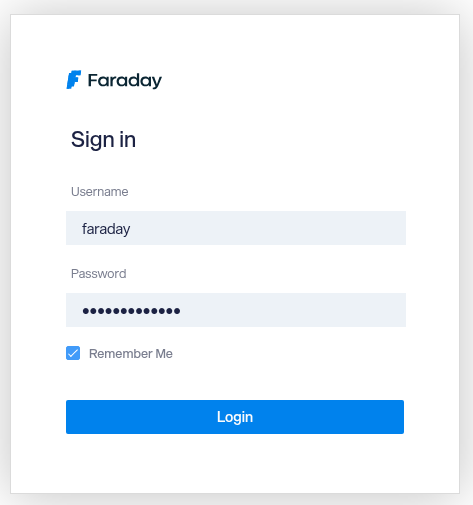
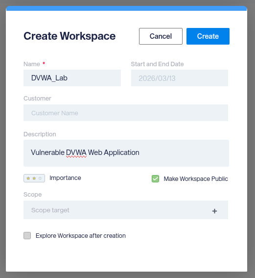
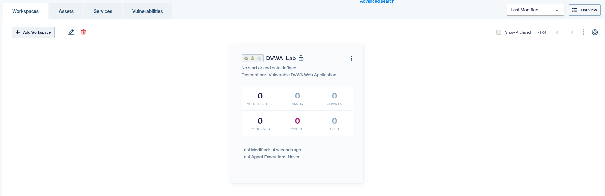
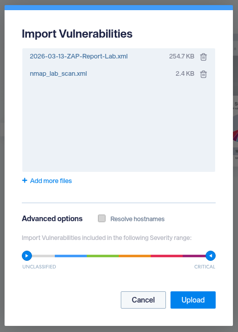
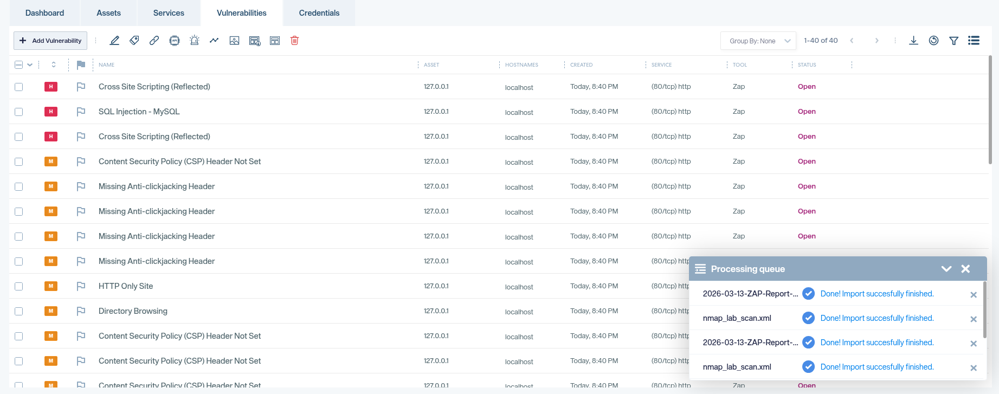
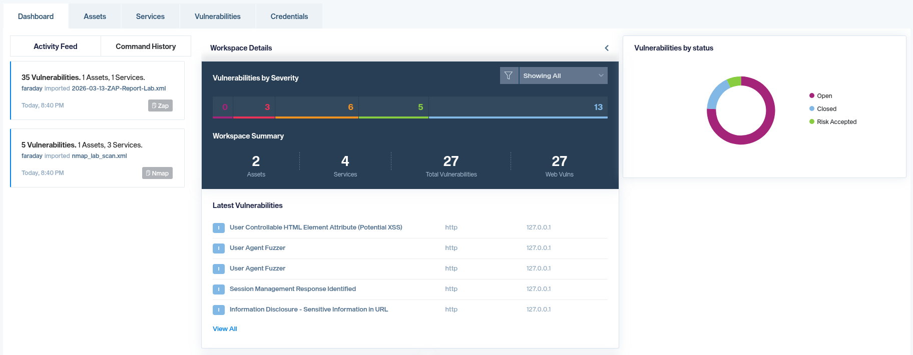
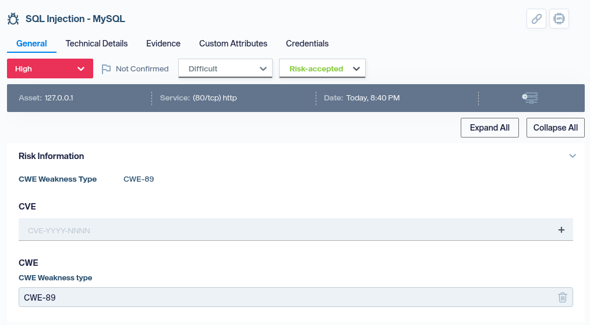
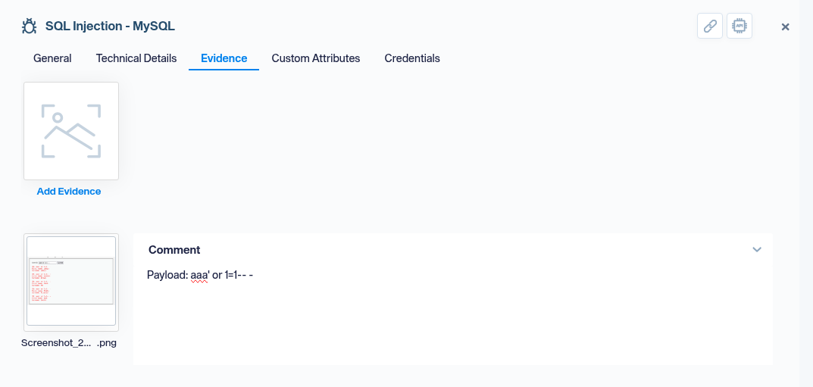

# Faraday - Step-by-Step Guide

Faraday is an open‑source vulnerability management platform. This document describes how a pile of scan reports can be turned into structured, manageable data.

It helps with real-time teamwork, automatically deduplicating overlapping vulnerabilities, and generating final security reports.

---

## 1. Practical case: scenario

Consider the following situation:

- Several scanners have already been run (nmap, ZAP, ...) on a vulnerable DVWA web app.
- The tools have produced **report files** (XML, JSON, CSV).
- The analyst must make sense of the data and communicate the risk.

Instead of reading each report separately, **one Faraday workspace** is used to centralise everything and work from a single place.

---

## 2. Installation and startup

The lab uses the official Docker setup from the Faraday documentation.

Steps:

1. Obtain the `docker-compose.yaml` from the official guide:  
   <https://docs.faradaysec.com/Install-guide-Docker/>
2. In that directory, start the containers:

   ```bash
   docker compose up -d
   ```

3. On first run, the initial admin password is printed in the logs:

   ```bash
   docker compose logs faraday-server
   ```

4. The web interface is accessed at:

   - URL: `http://localhost:5985`
   - User: `faraday`
   - Password: the value shown in the logs



---

## 3. Creating the workspace

Once Faraday is running, the first step is to create a workspace for the assessment.

Procedure:

1. From the left menu, go to **Workspaces** / **Home**.
2. Click **Create workspace**.
3. Enter a clear name (e.g. `DVWA_Lab`) and, optionally, a description and dates.
4. Save and open the new workspace.





All subsequent imports are attached to this workspace.

---

## 4. Importing vulnerability reports

Faraday does not replace scanners; it consumes their output. The goal is to bring all results into one workspace.

Procedure:

1. With the workspace open, go to **Vulnerabilities**.
2. Click **Import from file** / **+ Add Vulnerability**.
3. In the dialog, browse for each report file or drag and drop it.
4. Repeat for every tool report to be centralised.

Faraday supports a long list of tools via plugins; supported formats are parsed and normalised (hosts, services, vulnerabilities).





At this point the workspace contains enough data for the dashboard and detailed analysis.

---

## 5. Dashboard and graphs

The **Dashboard** provides a high‑level view of the engagement without opening each finding.

The dashboard typically shows:

- A bar chart of **vulnerabilities by severity**.
- A donut chart of **vulnerabilities by status** (open, closed, etc.).
- A **workspace summary** (number of assets, services, total vulnerabilities).
- A **latest vulnerabilities** list with recently imported findings.



This view helps answer questions such as: how many high or critical issues exist; whether risk is concentrated on few assets or spread out; and whether the number of open vulnerabilities is decreasing over time.

---

## 6. Exploring and documenting vulnerabilities

After the overview, the next step is to work through individual findings.

Typical procedure:

1. In **Vulnerabilities**, use filters (severity, status, host, service, tool) to narrow the list.
2. Open a finding of interest (e.g. high risk).
3. On the **General** tab, review title, severity, status, affected asset and service.
4. Set tags and status to reflect the analysis (e.g. `confirmed`, `needs-fix`, `false-positive`).
5. On **Evidence**, add payloads, screenshots or notes that document the issue.





At this level the tool becomes an analysis record: what was tested, how it was reproduced, and what decision was taken can be traced later.

---

## 7. Faraday-CLI cheatsheet

- `faraday-cli auth` — Log in to Faraday server
- `faraday-cli status` — Show connection and active workspace
- `faraday-cli workspace list` — List workspaces
- `faraday-cli workspace create NAME` — Create workspace
- `faraday-cli workspace select NAME` — Set active workspace
- `faraday-cli workspace get NAME` — Workspace details
- `faraday-cli workspace delete NAME` — Delete workspace
- `faraday-cli workspace dashboard` — Summary (hosts, services, vulns)
- `faraday-cli host list` — List hosts
- `faraday-cli host get ID` — Host details
- `faraday-cli host create -d '[...]'` — Create host(s) from JSON
- `faraday-cli host delete ID` — Delete host
- `faraday-cli service list` — List services
- `faraday-cli vuln list` — List vulnerabilities (paginated)
- `faraday-cli vuln add-evidence -id ID IMAGE` — Add image to vuln
- `faraday-cli vuln update ID --status STATUS` — Update vuln (e.g. closed)
- `faraday-cli vuln delete ID` — Delete vuln
- `faraday-cli tool report PATH` — Import report file (nmap, OpenVAS, ZAP, etc.)
- `faraday-cli tool run "COMMAND"` — Run tool and send results to Faraday
- `faraday-cli stats --type severity|vulns|date` — Vuln statistics
- `faraday-cli agent list` — List agents
- `faraday-cli agent get ID` — Agent details
- `faraday-cli agent run -a ID -e EXECUTOR -w WORKSPACE` — Run executor
- `faraday-cli help [COMMAND]` — List commands or show help for one

Use `-w NAME` for another workspace; `-p` for pretty tables; `-j` for JSON.

---

## 8. References

- Faraday: <https://www.faradaysec.com/>
- Documentation: <https://docs.faradaysec.com/>
- Install with Docker: <https://docs.faradaysec.com/Install-guide-Docker/>
- First steps: <https://docs.faradaysec.com/First-Steps/>
- Importing: <https://docs.faradaysec.com/import/>
- Dashboard: <https://docs.faradaysec.com/Dashboard-v4/>
- Plugin list (supported tools): <https://github.com/infobyte/faraday/wiki/Plugin-List>
- Faraday CLI: <https://docs.faraday-cli.faradaysec.com/>

---
